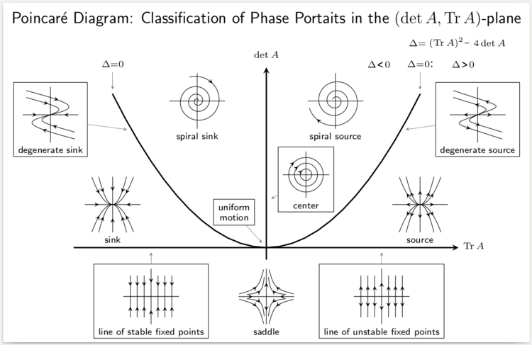

---
tags:
  - Stabilität
---
---
### Asymptotik und Stabilität
---

>Stabilitätsdiagramm von #LAS (y'=Ay)

---
$D\subset \mathbb{R}^{n+1}$ offen, $f:D\to \mathbb{R}^{n} \in C^{1},x_{0}\in \mathbb{R}$
$y:[x_{0};\infty)\to \mathbb{R}^{n}$ Lsg. von $y'=f(x,y) \quad y_{0}:=y(x_{0})$
$y$ heißt
- (f-) stabil (auf $[x_{0};\infty)$)
$$\forall\epsilon>0\quad\exists\delta>0:\quad||y_{0}-z_{0}||<\delta\Rightarrow||y_{x_{0}y_{0}}(t)-y_{x_{0}z_{0}}(t)||_\text{sup}<\epsilon$$
- (f-) attraktiv (auf $[x_{0};\infty)$)
$$\exists\delta>0:\quad||y_{0}-z_{0}||\Rightarrow y_{x_{0}z_{0}}\text{ ex auf }I$$
- (f-) asymptotisch stabil $\Leftrightarrow$ stabil und attraktiv

